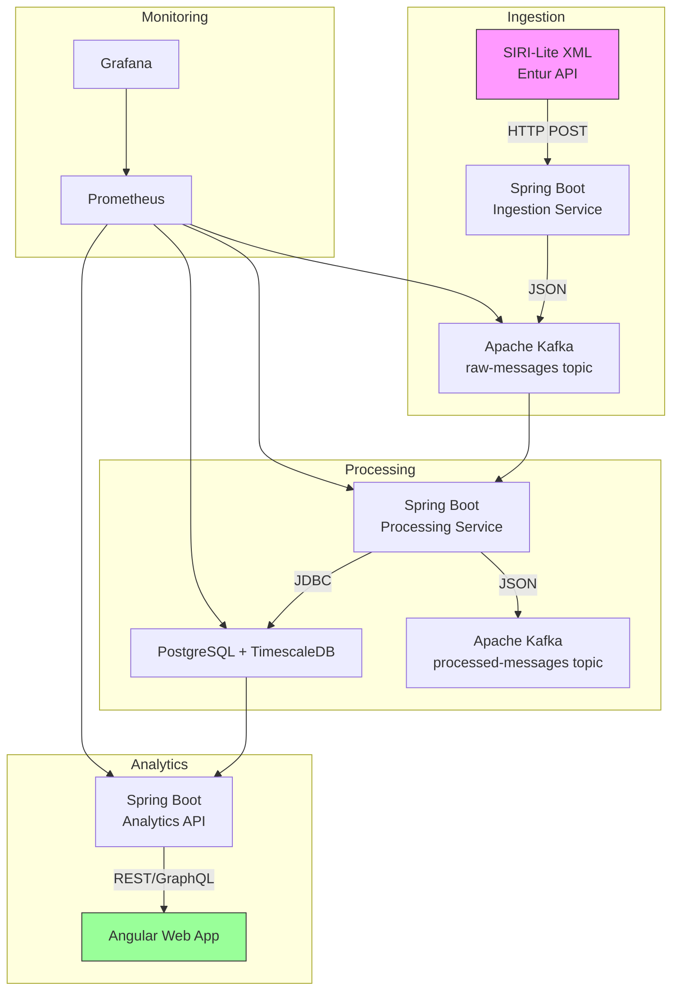

# SIRI-Lite Data Ingestion and Visualization Architecture

## Overview

This architecture describes a system for ingesting SIRI-Lite real-time public transport data from Entur, processing it, and visualizing it through an Angular web application.

## Architecture Diagram

## Component Details

### 1. SIRI-Lite Ingestion Service (Spring Boot)
Responsibilities:
- Receive XML messages from Entur's SIRI-Lite API
- Validate and convert XML to JSON
- Publish messages to Kafka

### 2. Message Broker (Apache Kafka)
Configuration:
- Topic: siri-raw-messages (for incoming messages)
- Topic: siri-processed-messages (optional, for cleaned data)
- Partitioning by vehicle/line identifier
- Retention policy based on business needs

### 3. Data Processing Service (Spring Boot)
Responsibilities:
- Consume messages from Kafka
- Data validation and cleaning
- Database operations (upserts)
- Optional: Data enrichment

### 4. Database Layer (PostgreSQL + TimescaleDB)
Schema Design:
- Static data tables for vehicles, stops, routes
- Timeseries data using TimescaleDB hypertables
- Geospatial extensions for location data

### 5. Analytics API (Spring Boot)
Key Endpoints:
- Current vehicle positions
- Next arrivals at stops
- Historical delay statistics
- Service alerts and notifications

### 6. Frontend (Angular)
Main Components:
- Map view with real-time vehicle positions
- Stop information with next departures
- Analytics dashboard with historical data
- Alerts and notifications panel

## Deployment Architecture

flowchart TB
    subgraph AWS/GCP/Azure
        subgraph Kubernetes Cluster
            A[Ingestion Pods] -->|HTTP| B[Load Balancer]
            C[Processing Pods] -->|Kafka| D[Kafka Cluster]
            E[API Pods] -->|JDBC| F[PostgreSQL]
            G[Frontend Pods] -->|HTTP| H[CDN]
        end

        I[Monitoring] -->|Scrape| A
        I --> C
        I --> E
        I --> F
    end

    External[Entur API] -->|HTTPS| B
    Users[Web Browsers] -->|HTTPS| H

## Data Flow Example

1. Ingestion:
   Entur SIRI-Lite XML → Spring Boot → Kafka (raw topic)

2. Processing:
   Kafka (raw) → Spring Boot → Data Cleaning → PostgreSQL → Kafka (processed)

3. Visualization:
   Angular → Analytics API → PostgreSQL → Response

## Technology Stack Summary

Component | Technology
-----------|------------
Ingestion | Spring Boot, Kafka
Processing | Spring Boot, Kafka, PostgreSQL
Storage | PostgreSQL + TimescaleDB
API | Spring Boot, Spring Security
Frontend | Angular, TypeScript, RxJS
Monitoring | Prometheus, Grafana, ELK
Infrastructure | Kubernetes, Docker, Terraform

## Considerations

1. Performance:
   - Kafka partitioning strategy should match query patterns
   - TimescaleDB compression policies for old data
   - Frontend: Virtual scrolling for large datasets

2. Reliability:
   - Kafka consumer lag monitoring
   - Database connection pooling
   - Circuit breakers for external dependencies

3. Security:
   - API authentication (OAuth2/JWT)
   - HTTPS for all communications
   - Database encryption at rest

4. Scalability:
   - Horizontal scaling of stateless services
   - Read replicas for analytics queries
   - Caching layer (Redis) for frequent queries
