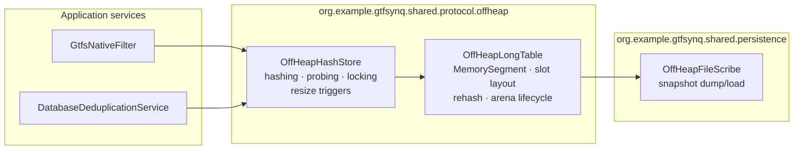
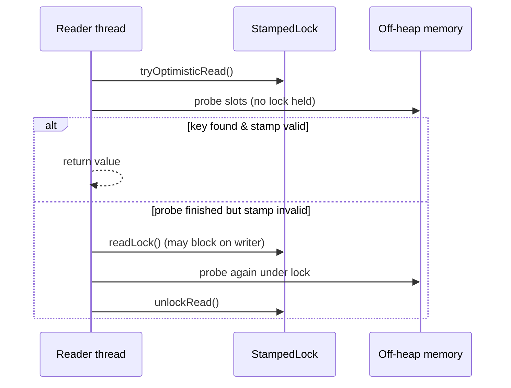
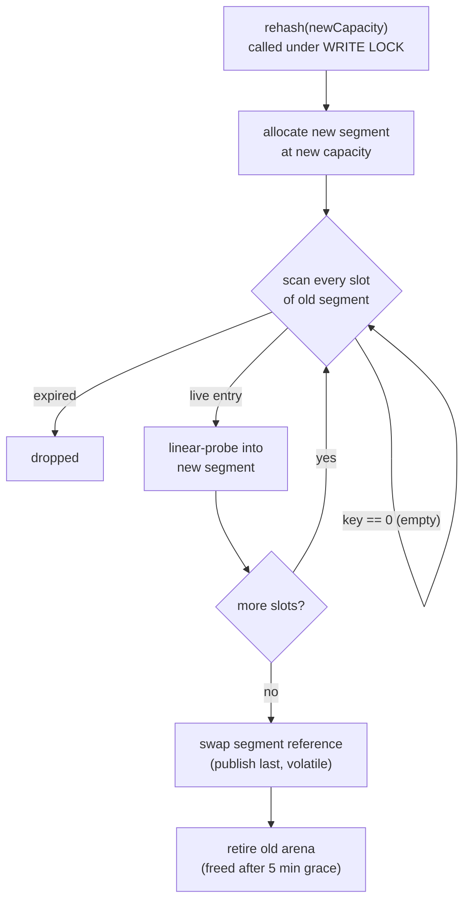

# Off-Heap Deduplication Map

How `OffHeapHashStore`, `OffHeapLongTable`, and `OffHeapFileScribe` work together.

## Overview

The deduplication map is a fixed-layout, open-addressing hash table that lives
entirely **off the Java heap**. It maps a 64-bit hash key to a 64-bit value
plus two 32-bit metadata slots, with a built-in **60-minute TTL**.

Three classes cooperate:

| Class               | Responsibility                                                           |
| ------------------- | ------------------------------------------------------------------------ |
| `OffHeapHashStore`  | Hash-table logic: probe, insert, expiry, locking, resize triggers        |
| `OffHeapLongTable`  | Raw memory: foreign-memory segment, slot layout, rehash, arena lifecycle |
| `OffHeapFileScribe` | Persistence: snapshot dump/load with an atomic file swap                 |



## Slot layout

Each entry occupies exactly **32 bytes** (half a cache line):

```
Offset  Size  Field
------  ----  -----------------
  0      8    key        (0 = empty slot sentinel)
  8      8    value
 16      4    expiry     (epoch minute at which the entry dies)
 20      4    psl        (unused, reserved — kept for 32-byte alignment)
 24      4    customSlot1
 28      4    customSlot2
```

- `key = 0` marks an empty slot, so `0` is not a legal key.
- `value = 0` is returned to mean "absent" — a stored value of `0` is
  indistinguishable from a miss.
- The table is an **array of slots**, power-of-two sized, indexed by
  `hash(key) & (capacity - 1)`.

## Concurrency model

Reads and writes are coordinated by a single `StampedLock`:

- **Writes** (`put`, resize, maintenance) take the **write lock**. There is
  exactly one writer at a time.
- **Reads** (`get`, `getWithCustomSlots`) first attempt a **lock-free
  optimistic read**: they probe the memory directly and validate the stamp at
  the end. If validation fails — e.g. a writer ran concurrently — the reader
  retries under a full **read lock**.



### Why every return path validates

Each memory accessor re-reads the volatile `segment` field. A concurrent
resize can therefore swap the segment _mid-probe_, producing mixed reads from
the old and new memory. Any read taken without the lock is untrustworthy
unless the stamp still validates — including "not found" answers. Failing
that, the reader gets the `PROHIBITED_WRITE` sentinel and retries under the
read lock, which is guaranteed to see a consistent table.

### Memory safety during resize

A resize allocates a brand-new segment and retires the old one. The old
arena is **not freed immediately**: retired arenas are kept for a 5-minute
grace period (purged by a scheduled task) so any in-flight optimistic reader
that still references the old segment can finish safely instead of touching
freed memory.

## Expiry (TTL)

Every insert stamps `expiry = currentMinute + 60`. The current minute is a
volatile field refreshed by a scheduled task once per minute.

- **Reads** treat an expired entry as absent (lazily — the slot is not freed).
- **Inserts** reuse expired slots: the probe remembers the first expired slot
  it passes (`firstAvailableIndex`) and overwrites it, keeping live entries
  tightly packed without ever deleting.

## Resizing

The table starts at 65,536 slots (2 MiB) and rebalances itself based on the
number of **live** (non-expired) entries:

| Condition (live load) | Action                                                        |
| --------------------- | ------------------------------------------------------------- |
| ≥ 70 %                | **Grow** — double capacity (capped at 2²⁶ slots ≈ 2 GiB)      |
| ≤ 17 %                | **Shrink** — halve capacity (floored at the initial capacity) |
| < 50 %                | **Compact** — same capacity, expired entries dropped          |
| otherwise             | nothing                                                       |

Two triggers feed into `autoResize`:

1. **Insert-driven growth** — after an insert into a previously empty slot,
   if occupancy ≥ 70 % of capacity.
2. **Scheduled maintenance** (`autoTune`, every minute) — only runs its
   O(capacity) scan when it can pay off, gated by either:
   - **occupancy below the shrink watermark** (≤ 17 %): occupied slots bound
     the live count from above, so a shrink is guaranteed to apply, or
   - **expired-slot overwrite pressure** (≥ ⅛ of capacity recycled): catches
     clutter compaction that occupancy can never reveal, because occupancy
     never drops on its own — expired entries are only recycled by
     overwriting.

### Rehash mechanics



Because the whole rehash runs under the write lock, readers see either the
old or the new table — never a mixture — once their stamp validates. The
rehash **blocks all traffic** for its duration (roughly 250 ms at 8M slots
up to ~800 ms at max capacity); growth is amortized over millions of
subsequent inserts.

## Persistence

`OffHeapFileScribe` snapshots the raw segment to disk every minute:

```
Dump file layout:
+--------------------+--------------------------------+
| 16-byte header     | raw slot bytes                 |
| magic | capacity   | (capacity * 32 bytes)          |
+--------------------+--------------------------------+
```

- The dump is written to a `<file>.tmp` and **atomically moved** into place,
  so a crash mid-dump cannot corrupt the previous snapshot.
- Large segments are transferred in 64 MB slices (`asByteBuffer()` cannot
  exceed `Integer.MAX_VALUE` bytes, and the table can at max capacity).
- On startup the constructor loads the snapshot; if the header's capacity
  differs from the current one, the table **reallocates** to match before
  reading.
- Legacy header-less files (pre-resize dumps) are detected via the magic and
  skipped.
- Dumps run **without** the store lock, so a snapshot may contain torn
  entries; the next dump supersedes it, and losing at most one snapshot
  interval of a 60-minute TTL cache is acceptable.

## Scheduled tasks

All tasks run on Spring's scheduler (single-threaded by default):

| Task                 | Rate | Purpose                                                     |
| -------------------- | ---- | ----------------------------------------------------------- |
| `tickMinute`         | 60 s | Refresh the cached "current minute"                         |
| `autoTune`           | 60 s | Maintenance resize scan (gated by stale-overwrite pressure) |
| `backup`             | 60 s | Snapshot to disk                                            |
| `purgeRetiredArenas` | 60 s | Free arenas retired ≥ 5 min ago                             |

## Known trade-offs

- **Resize freezes**: the write lock is held for the whole rehash — all
  readers and writers stall for its duration.
- **Sentinels**: stored values `-1` and `0` collide with the
  `PROHIBITED_WRITE` retry signal and the "absent" marker respectively.
- **Returned arrays are shared**: `EMPTY_VALUE_ARRAY` is a singleton —
  callers must treat returned `long[]` as read-only.
- **Single-writer**: all writes serialize on one lock; reads are the hot path
  and remain lock-free in the common case.
